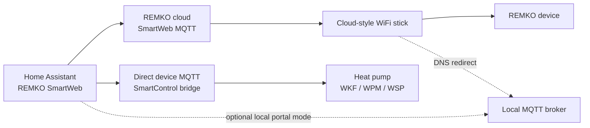

# REMKO SmartWeb — Home Assistant Integration

[](https://github.com/hacs/integration)


Control and monitor your REMKO heat pump, air conditioner, or hot water device from Home Assistant — temperatures, operating modes, switches, and more. Works via the REMKO SmartWeb cloud (internet connection required).

> **Not affiliated with REMKO.** This is a community integration and may break if REMKO changes their backend.

---

## Requirements

- A REMKO device with **SmartWeb** connectivity
- An active **REMKO SmartWeb account** (the same login you use in the REMKO app)

---

## Installation

**Via HACS (recommended)**

1. HACS → Integrations → ⋮ → **Custom repositories**
2. Add `https://github.com/Christoph-87/remko-smartweb-ha`, category **Integration**
3. Install **REMKO SmartWeb** and restart Home Assistant

**Then add the integration:**

[](https://my.home-assistant.io/redirect/config_flow_start/?domain=remko_smartweb)

Or go to **Settings → Devices & Services → Add Integration** and search for `REMKO SmartWeb`.

<details>
<summary>Manual installation</summary>

Copy the `custom_components/remko_smartweb/` folder into your Home Assistant config directory and restart.

</details>

---

## Supported devices

| Device | Models | Cloud path | Redirected WiFi stick | Direct MQTT / SmartControl |
|--------|--------|:----------:|:---------------------:|:--------------------------:|
| ❄️ **Air conditioner** | MXW 204 / 264 / 354 / 524 | ✅ Confirmed | ⚠️ Observed | — |
| ❄️ **Air conditioner** | SKW 521 DC, RVD 525 DC | ✅ Confirmed | ❓ Unknown | — |
| ❄️ **Air conditioner** | RKL 495 DC | ✅ Confirmed | ❓ Unknown | — |
| ❄️ **Air conditioner** | RKL 355 DC | ✅ Confirmed | ❓ Unknown | — |
| ❄️ **Air conditioner** | BL 264–354 DC, BL 353 DC | ✅ Confirmed | ❓ Unknown | — |
| 🚿 **Domestic hot water** | RBW 302 Pro | ✅ Confirmed | ❓ Unknown | — |
| 💧 **Dehumidifier** | LTE series | ✅ Confirmed | ❓ Unknown | — |
| 🌡️ **Compact heat pump** | KWT 180–300 DC | ✅ Confirmed | ❓ Unknown | — |
| 🔥 **Heat pump** | WKF/WPM systems | ⚠️ Experimental | ❓ Unknown | ⚠️ Observed |
| 🔥 **Heat pump** | WSP systems | ❓ Unknown | ❓ Unknown | ⚠️ Observed |
| ❄️ **Air conditioner candidates** | MXD 204–524, MXT 355/525, ATY / ATY Deko, ML DC, RVD/RVT/RWT/RXK/RXT DC | ❓ Unknown | ❓ Unknown | — |
| ❄️ **Multi-split outdoor unit** | MVT DC | — | — | — |
| 🔥 **Heat pump candidates** | WKM / WKM Pro, WPK, SQW 405 Pro, HTS Duo, MWL | ❓ Unknown | ❓ Unknown | ❓ Unknown |
| ❓ **Other** | Any other SmartWeb device | ⚠️ Diagnostics | — | — |

✅ Confirmed &nbsp;·&nbsp; ⚠️ Experimental / device-dependent &nbsp;·&nbsp; ❓ Unknown &nbsp;·&nbsp; — Not expected / not applicable

The 0.4.x device families are confirmed through the REMKO SmartWeb cloud path.
Local support is split into two different experiments: redirected cloud-style
WiFi sticks, and direct SmartControl MQTT seen mainly on heat pumps. The model
catalog in [`docs/remko_model_catalog.csv`](docs/remko_model_catalog.csv) is only
research evidence; it is not a support guarantee. For split and multi-split
systems, the indoor unit series is usually more relevant than the outdoor unit.
Architecture notes are in
[`docs/device_profile_architecture.md`](docs/device_profile_architecture.md).

For unknown devices, the integration creates a **Diagnostics sensor** that logs data payloads — useful for adding support later.

**Domestic hot water note:** REMKO requires a vacation end date before Vacation mode is activated. Set the `DHW vacation end date` date entity first, then select Vacation mode on the water-heater entity.

---

## Experimental local MQTT mode

Cloud-only installations do **not** need a local MQTT broker, DNS rewrite, or
AdGuard rule. Local MQTT is optional and experimental.

There are two different local architectures:

- **Redirected WiFi stick / local portal broker**: a cloud-style WiFi stick is
  redirected by DNS to a local MQTT broker. This keeps the cloud-style topic
  model, but moves the broker locally.
- **Direct device MQTT / SmartControl bridge**: the device or SmartControl
  bridge exposes MQTT directly, commonly with topics such as
  `V04P28/SMTID/...`. This path is mainly heat-pump evidence so far.



Local setup still starts from a cloud-discovered REMKO device where possible.
The detailed setup, DNS/broker requirements, diagnostics, and troubleshooting
are documented in [`docs/local_connection_modes.md`](docs/local_connection_modes.md).

---

## Troubleshooting

| Problem | What to try |
|---------|-------------|
| No entities after install | Restart Home Assistant |
| Entities unavailable | Check internet access · reduce the polling interval in options |
| `SmartWeb returned an empty or unparseable device list from /rest/liste` | Update to the latest version and restart Home Assistant. REMKO may block non-browser HTTP clients; current versions keep a browser-like user agent on the full SmartWeb session, not only during login. |
| `SET readback mismatch` after a climate command | The device may report the old state for a few seconds after accepting a command. Current versions retry the immediate readback and log pending confirmation instead of warning too early. |
| Local MQTT device accepts commands slowly or times out | Update to a local-portal build that sends ESP SET frames to the SID-based command topic and treats local readback as pending. Also verify Mosquitto listener authentication is separated so the stick's `8883` subscriptions are not denied by the authenticated HA listener. |
| Commands feel slow | SmartWeb is cloud-based — a few seconds of delay is normal |
| A control doesn't work | Enable debug logging (see below), try the same action in the REMKO app, then open an issue |

**Enable debug logging** in `configuration.yaml`:

```yaml
logger:
  default: warning
  logs:
    custom_components.remko_smartweb: debug
```

Restart or reload the integration. Logs appear under **Settings → System → Logs**.

---

## My device isn't supported — can you add it?

Yes! The integration can connect to any SmartWeb device and collect diagnostic data that helps with mapping new sensors and controls.

1. Add the integration — it creates a **Diagnostics sensor** for unknown devices
2. Enable debug logging and let it run for a few minutes
3. If the REMKO app lets you change a value, change **one thing at a time** and note what and when
4. [Open an issue](https://github.com/Christoph-87/remko-smartweb-ha/issues) and include:
   - REMKO model name and device name from the app
   - Diagnostics sensor attributes (`detected_profile`, `portal_type`, `portal_dev`)
   - Relevant lines from the debug log
   - Screenshots from the REMKO app showing available settings

> Remove your email, password, and session IDs before sharing any logs.
