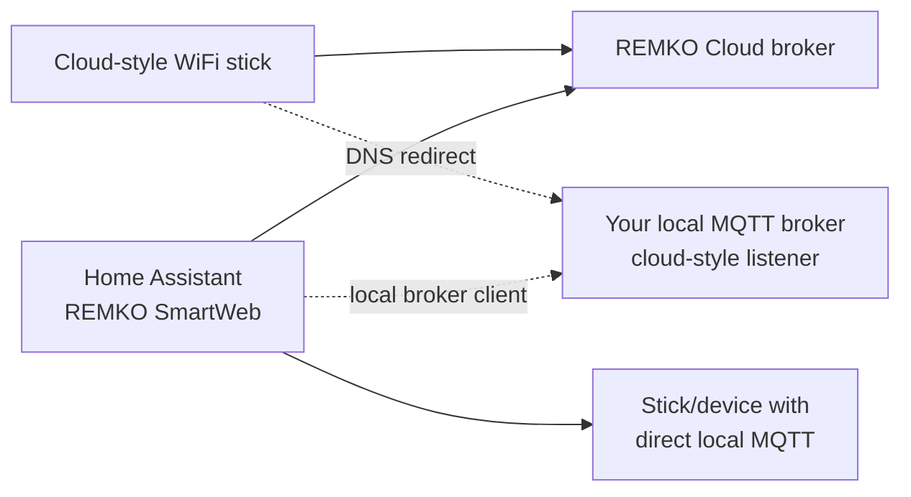

# Local Connection Modes

This page explains the optional local connection modes for REMKO devices and how
to run a REMKO Cloud-style WiFi stick through your own local broker.

Most users should start with the normal REMKO Cloud setup. Local mode is
experimental and should be enabled one device at a time.

## Which Path Do I Need?

The communication module determines which local path is possible:

| Path | Use when | Notes |
|------|----------|-------|
| REMKO Cloud | The device works through the REMKO app or SmartWeb portal | This is the confirmed path for the 0.4.x device families. |
| Redirected cloud-style stick | The device uses a REMKO Cloud WiFi stick that connects outward to REMKO's broker, and you want to run that traffic locally | DNS redirects only that stick to your local broker. Home Assistant talks to the same local broker. |
| Local MQTT on stick/device | The stick/device exposes MQTT directly on its own IP or through a SmartControl bridge | Mainly observed on heat-pump/SmartControl setups so far. This is not the same as redirecting a Cloud stick. |

Do not configure DNS redirect for a stick/device that already exposes local MQTT
directly. A Cloud-style WiFi stick normally needs either the REMKO Cloud path or
the redirected-stick path; a direct-MQTT device uses the local MQTT path.



## Before You Start

For a redirected WiFi-stick setup you need:

- a device that already works through the REMKO Cloud path
- the IP address of the selected REMKO WiFi stick
- a local MQTT broker reachable from Home Assistant
- a stick-facing MQTT listener for the redirected stick
- a DNS rule that affects only the selected stick

Keep the REMKO Cloud entry working until local readback is confirmed. Do not
redirect all devices at once.

## Recommended Redirect Setup

The redirected-stick setup has two MQTT sides:

| Side | Used by | Typical port | Authentication |
|------|---------|--------------|----------------|
| Home Assistant listener | Home Assistant integration | `1883` | username/password recommended |
| Stick-facing listener | REMKO WiFi stick after DNS redirect | `8883` | allow the stick to connect without Home Assistant credentials |

Use separate listener settings so the stick is not rejected by the Home
Assistant listener's username/password rules. In Mosquitto this usually means
`per_listener_settings true`, with authentication enabled on the Home
Assistant-facing listener and disabled on the stick-facing listener.

Example Mosquitto shape:

```conf
per_listener_settings true

listener 1883
allow_anonymous false
password_file /mosquitto/config/passwords

listener 8883
cafile /mosquitto/config/ca.crt
certfile /mosquitto/config/smartweb.remko.media.crt
keyfile /mosquitto/config/smartweb.remko.media.key
allow_anonymous true
```

This is only a shape, not a drop-in configuration. Keep your own broker paths,
ACLs, container mounts, and certificate handling consistent with your setup.
The important point is that the redirected REMKO stick can connect to the
`8883` listener, while Home Assistant uses the separate `1883` listener.

## Certificate Requirement

The redirected stick connects to `smartweb.remko.media`. For a local redirect,
the stick-facing broker certificate therefore needs `smartweb.remko.media` as
CN/SAN.

Most users cannot get a public CA certificate for that name because they do not
control the domain. In practice, redirected setups usually use a private or
self-signed certificate for the stick-facing listener.

The integration does not create broker certificates. Certificate setup belongs
to your MQTT broker and network environment.

## DNS Redirect

Redirect only the selected stick, not the whole network. Home Assistant and
other devices may still need the real REMKO cloud endpoint.

With AdGuard Home, prefer a client-scoped rule:

```text
||smartweb.remko.media^$client=<stick-ip>,dnsrewrite=<broker-ip>
```

Replace:

- `<stick-ip>` with the REMKO WiFi stick IP
- `<broker-ip>` with the local MQTT broker IP

Equivalent per-client rules in Pi-hole, dnsmasq, Unbound, router DNS, or another
DNS server are fine. Avoid a global rewrite unless you fully understand the
impact.

## Home Assistant Integration Setup

1. Add or keep the device through the normal REMKO Cloud setup.
2. Open the integration options for the selected device and go to
   **Local connection**.
3. For **Local MQTT mode**, choose
   **Redirected WiFi stick / local portal broker**.
4. Enter the **Stick IP candidate**. This is only used for validation; it is not
   the MQTT broker host.
5. In the shared broker step, enter the local broker host and Home Assistant
   listener port, commonly `1883`.
6. Enter the Home Assistant-side MQTT username/password if your broker requires
   it.
7. Save and check the diagnostics sensors/logs before relying on controls.

The stick itself should connect to the stick-facing listener after DNS is
changed. Home Assistant connects to the Home Assistant listener.

## Expected Topics

For redirected cloud-style sticks, useful evidence is:

- stick heartbeat: `V04P27/SMT.../HOST2PORTAL`
- local portal reply: `V04P27/SMT.../PORTAL2HOST`
- command/readback path after cloud identity is known:
  - `V04P27/<SID>/ESP`
  - `V04P27/<SID>/RESP`

For local MQTT on stick/device, useful evidence is different:

- data topic: `<node>/SMTID/HOST2CLIENT`
- command topic: `<node>/SMTID/CLIENT2HOST`

If you see `HOST2PORTAL`, you are looking at the redirected cloud-style stick
path. If you see `HOST2CLIENT` / `CLIENT2HOST` directly on a device MQTT node,
you are looking at the local MQTT on stick/device path.

## Verify the Redirect

After applying the DNS rule and restarting the stick if needed, check:

1. The stick can resolve `smartweb.remko.media` to the local broker IP.
2. The broker sees a connection on the stick-facing listener, usually `8883`.
3. The broker receives `V04P27/SMT.../HOST2PORTAL`.
4. Home Assistant can connect to the broker on the Home Assistant listener.
5. The integration diagnostics show local broker connectivity and recent local
   MQTT traffic.
6. A state readback arrives before you depend on write controls.

If the REMKO app stops controlling the device while the local broker sees stick
traffic, that is expected for a redirected cloud-style setup. The stick is no
longer connected to REMKO's broker while redirected locally.

## Troubleshooting

| Symptom | Likely cause | What to check |
|---------|--------------|---------------|
| No `HOST2PORTAL` topic | DNS rule not applied, wrong stick IP, stick did not reconnect | Verify per-client DNS, restart the stick, check broker `8883` logs. |
| TCP works but MQTT auth fails | Home Assistant listener and stick listener share auth settings | Use separate listener settings such as Mosquitto `per_listener_settings true`. |
| Stick connects then disconnects | TLS/certificate mismatch | Certificate CN/SAN should match `smartweb.remko.media`; check broker TLS logs. |
| Home Assistant connects but device does not react | Stick is not subscribed to the command topic or SID mapping is wrong | Check `HOST2PORTAL`, `/ESP`, `/RESP`, and diagnostics for command topic freshness. |
| Another stick appears | DNS rule affected the wrong client or multiple sticks share generic hostnames | Redirect one stick IP at a time and compare the observed `SMT...` topic. |
| REMKO app no longer works | Expected when the selected stick is redirected locally | Remove the DNS rule or switch back to REMKO Cloud mode. |

## What To Include In An Issue

If the redirect does not work, open an issue with:

- device model and WiFi stick model if known
- whether the same device works through REMKO Cloud
- selected local mode in the integration options
- broker type and listener ports
- whether the broker sees `HOST2PORTAL`
- redacted diagnostics attributes from the integration
- redacted debug logs around startup and one test command

Remove email addresses, passwords, cookies, session IDs, access keys, public IPs,
and full account details before posting logs.

## Technical Notes For Contributors

The integration should keep one semantic read/write layer:

```text
HA entity -> profile write/read plan -> transport adapter
```

Transport adapters should own:

- broker connection setup
- topic naming
- client ID style
- local portal heartbeat replies
- diagnostics for freshness, auth, subscriptions, and readback

Profiles should not need to know whether the device is using REMKO Cloud,
redirected cloud-style stick mode, or local MQTT on stick/device.

## Open Questions

- There is no reliable public device-model matrix yet. Hardware module and
  firmware seem more important than REMKO product family.
- RBW/DHW users may be useful testers for non-MXW cloud contracts, but local
  support depends on the actual communication module.
- Local MQTT on stick/device needs more redacted captures before it can be
  considered broadly supported.
